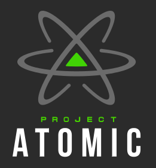

# Immutable Linux
## From Flatcar to Kairos

2026 recap

::: notes
Quick intro. Mention you've been to the conference multiple times.
Others cover general talks — you focus on one lab and a theme.
:::

---

# 2026: Last day: Workshops

## From Zero to Immutable Kubernetes
[*Mauro Morales and Dimitris Karakasilis*][1]

- Built a cluster from scratch
- Nodes provisioned as images
- No manual configuration steps

[1]: <https://cfp.cfgmgmtcamp.org/ghent2026/talk/W9LUC3/>

::: notes
Emphasize feeling: no SSHing around fixing things.
Compare to traditional install → configure → drift.
Here: build → boot → replace.
:::

---

# What is

- Open-source toolkit
- Not a traditional distro
- Turns Linux into an immutable system
- Focused on Kubernetes lifecycle

::: notes
Important: abstraction layer above distro.
Not “yet another OS”, but a way to build one.
:::

---

# I've heard this before?

- Image-based systems
- Declarative configuration
- Replace instead of patch

{ .right width=60% }

::: notes
This triggered memory of earlier lab.
Transition into rewind.
:::

---

# Rewind: Config Management Camp 2024

- Built and booted the OS
- Extended with `systemd-sysext`
- Swapped Docker → Podman
- Very container-focused

::: notes
More hands-on OS work.
Felt like building a container host.
:::

---

# Zooming out: Immutable Linux 

- OS should be reproducible
- Reduce configuration drift
- Updates should be atomic
- Extend instead of mutate

- Read-only root filesystem
- Updates via images or snapshots
- Config separated from OS
- Replace instead of patch

::: notes
Important clarification: not literally immutable.
It means controlled and predictable change.
Still had SSH and imperative steps.
Not fully “OS as artifact” yet.
:::

---

# Short history

- 2013: CoreOS
- Container-native OS model
- Automatic updates + rollback
- Later:
  - Red Hat CoreOS
  - Fedora Atomic

::: notes
CoreOS popularized this approach.
Not new — but now widespread.
2013–2020: immutable distros
2020–2024: ecosystem diversification
2024– → immutable toolchains & pipelines
:::

---

# The ecosystem today

- Flatcar (Container Linux)
- Bottlerocket
- openSUSE MicroOS
- Talos Linux
- Fedora Core OS (Atomic)

::: notes
Many implementations of same idea.
Different tradeoffs.
- A/B partition updates
- Snapshot-based systems
- OSTree-style systems
- Container-image-based OS
No single “correct” approach.
Explains ecosystem diversity.
:::

---

# Not truly immutable

- Systems still change
- Logs, state, config are writable
- Some runtime changes allowed

::: notes
control change, don’t eliminate it
Important insight from the field.
Linux was never designed to be immutable.
:::

---

# Late 2024: bootc

- OS delivered as container images
- Built with familiar tools
- Aligns OS with app pipelines

::: notes
This is a major shift.
Bridge between containers and OS.
:::

---

# Back to 2026: Kairos

- Now it makes more sense
- Builds on everything before it
- Works across distros
- OS defined in Dockerfile
- Built for lifecycle management
- Focus on clusters, not just nodes

::: notes
Others = distro
Kairos = platform/toolkit
:::

---

# How it works

- Build OS as image
- Deploy to nodes
- A/B partition updates
- Reboot and switch

::: notes
Same mental model as containers.
What is mutable
- Config and state only
- OS replaced on update
- Runtime changes discouraged

Forces discipline. 
Prevents snowflake systems. 
- New image deployed 
- Files replaced entirely 
- Services restart cleanly 
- Rollback if needed 
:::

---

## Compared to Talos

- Talos:
  - No shell
  - API-driven

- Kairos:
  - More flexible
  - Closer to traditional Linux

## Compared to Flatcar etc.

- Flatcar:
  - Fixed distro
- bootc:
  - Building block

- Kairos:
  - Full lifecycle approach

::: notes
Talos is more opinionated.
Kairos gives more control.
:::

---

# State of immutable Linux

- Not one standard approach
- Many competing models
- Focus shifting to lifecycle

- New operating systems:
  - disposable
  - reproducible
  - part of CI/CD

::: notes
immutability = managing change
Leave audience with this idea.
:::

---

# Questions

Thanks!
